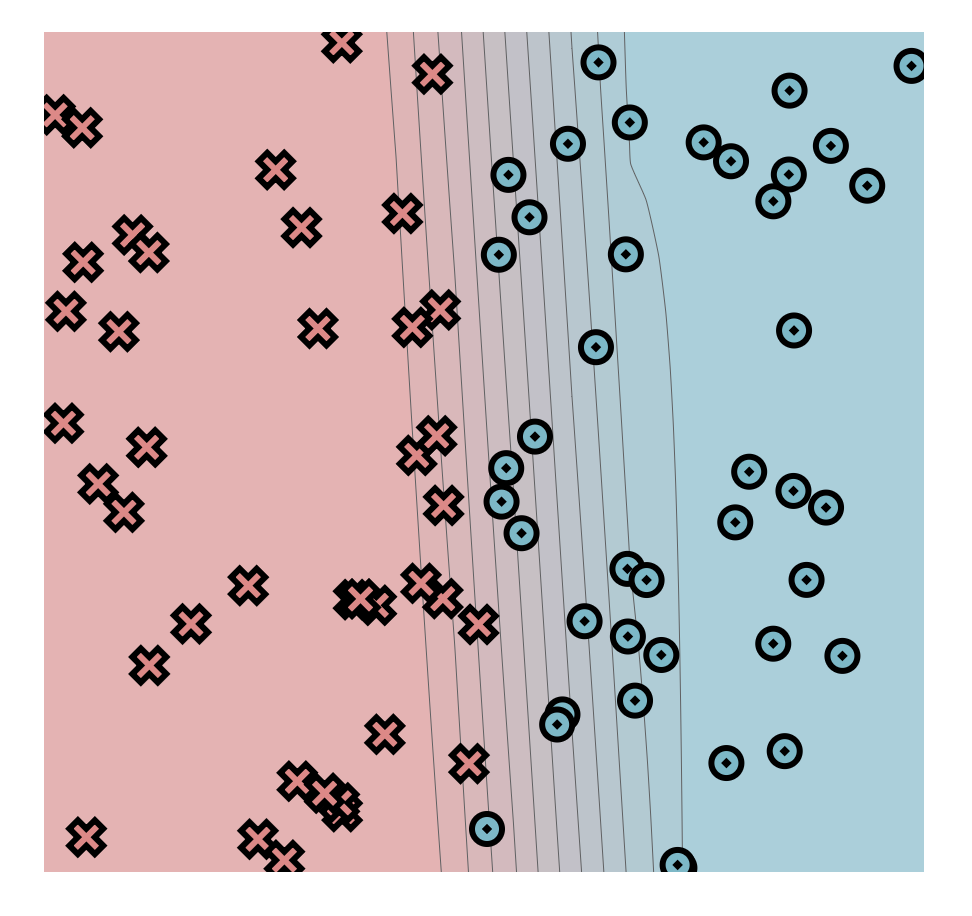
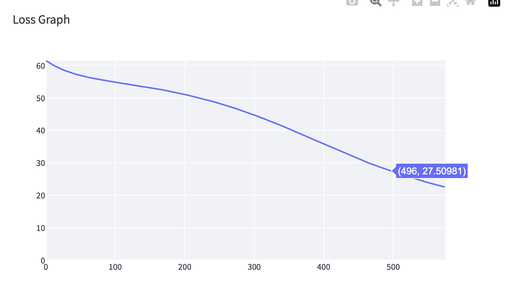
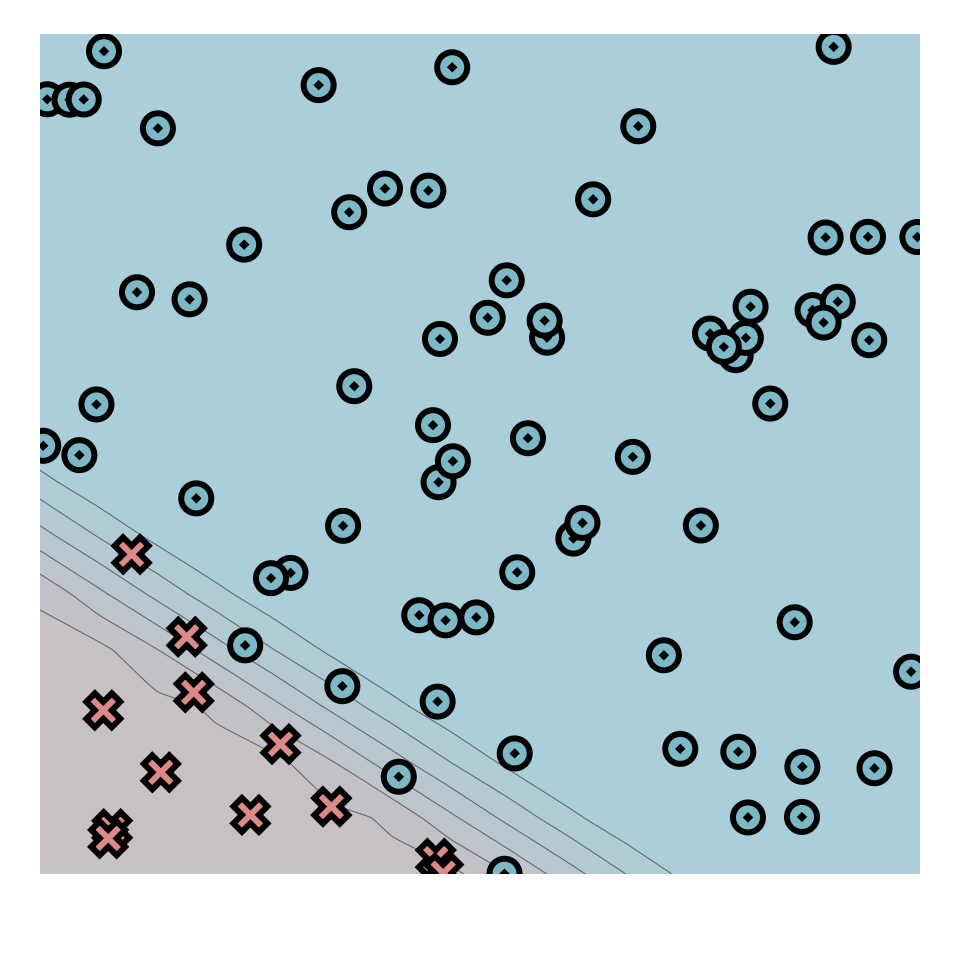
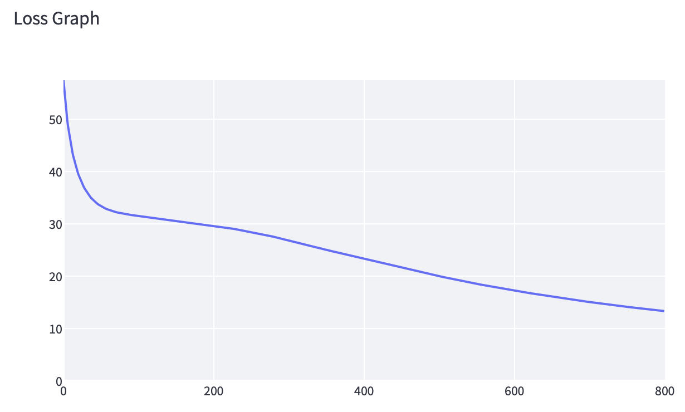
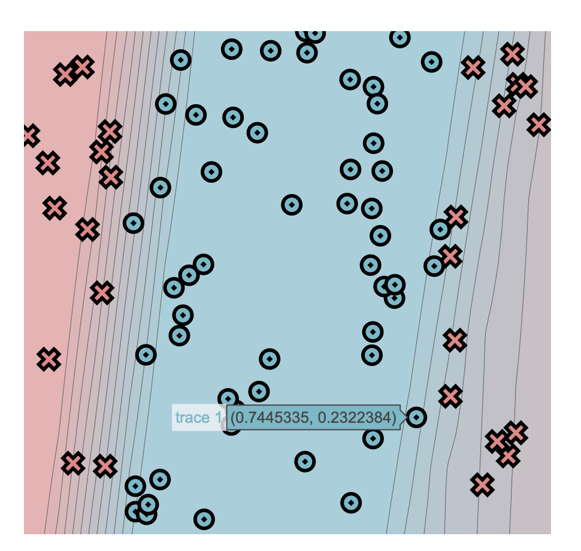
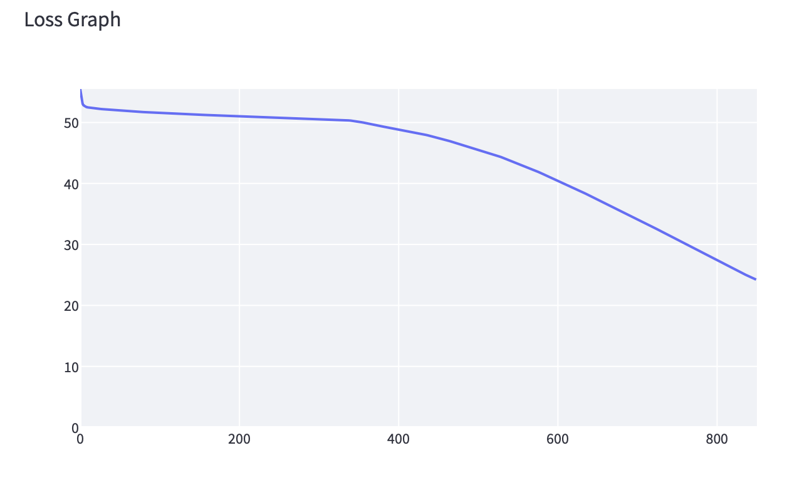
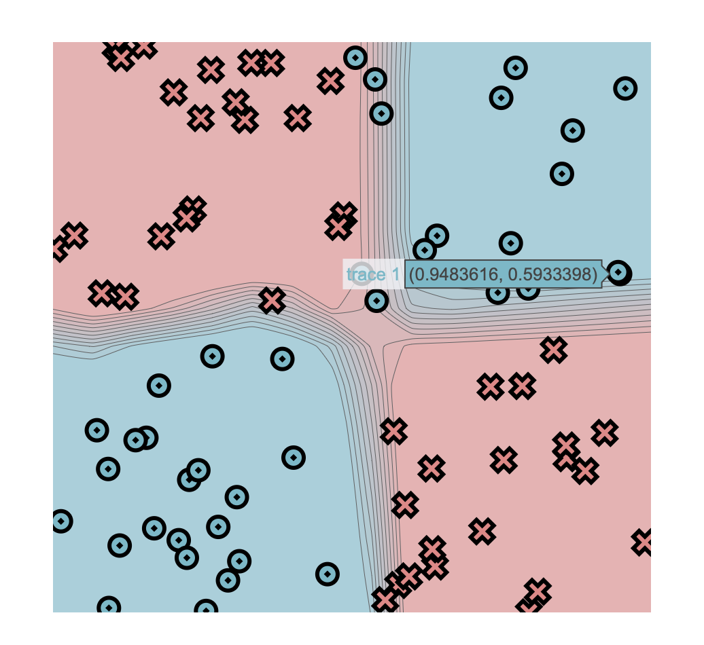
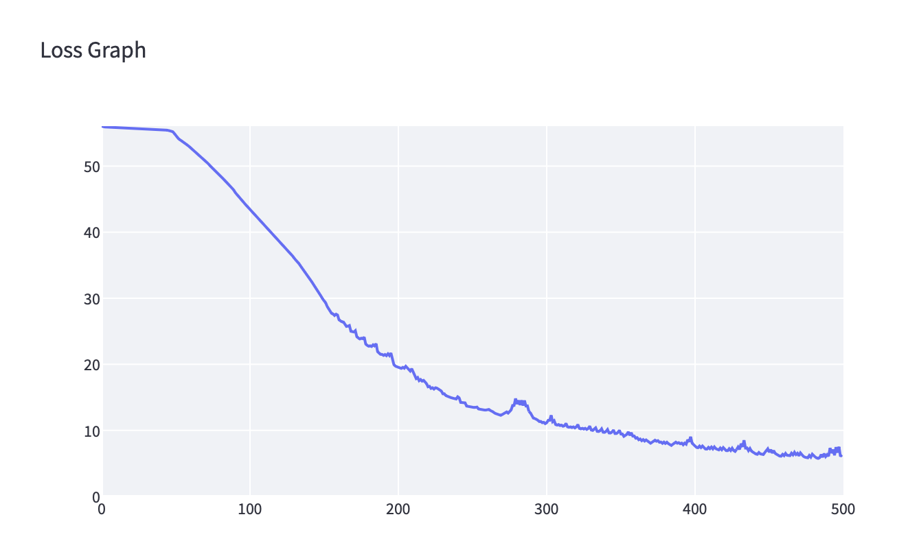

# MiniTorch Module 1


* Docs: https://minitorch.github.io/

* Overview: https://minitorch.github.io/module1/module1/

This assignment requires the following files from the previous assignments. You can get these by running

```bash
python sync_previous_module.py previous-module-dir current-module-dir
```

The files that will be synced are:

        minitorch/operators.py minitorch/module.py tests/test_module.py tests/test_operators.py project/run_manual.py

## Simple



Epoch: 0/575, loss: 0, correct: 0
Epoch: 10/575, loss: 59.64873731798884, correct: 40
Epoch: 20/575, loss: 58.17380330770635, correct: 40
Epoch: 30/575, loss: 57.382386718154294, correct: 40
Epoch: 40/575, loss: 56.930334227700996, correct: 40
Epoch: 50/575, loss: 56.65278099083016, correct: 40
Epoch: 60/575, loss: 56.47674467531025, correct: 40
Epoch: 70/575, loss: 56.365213395873155, correct: 40
Epoch: 80/575, loss: 56.28983523318482, correct: 40
Epoch: 90/575, loss: 56.239860838183624, correct: 40
Epoch: 100/575, loss: 56.21080161826743, correct: 40
Epoch: 110/575, loss: 56.19239613578657, correct: 40
Epoch: 120/575, loss: 56.17921913890152, correct: 40
Epoch: 130/575, loss: 56.170342344413896, correct: 40
Epoch: 140/575, loss: 56.163234891738625, correct: 37
Epoch: 150/575, loss: 56.15726883130895, correct: 40
Epoch: 160/575, loss: 56.15240082877507, correct: 40
Epoch: 170/575, loss: 56.15027166623475, correct: 40
Epoch: 180/575, loss: 56.14875377673078, correct: 40
Epoch: 190/575, loss: 56.14795365391628, correct: 41
Epoch: 200/575, loss: 56.147478799608976, correct: 41
Epoch: 210/575, loss: 56.14707515948881, correct: 41
Epoch: 220/575, loss: 56.14671795500268, correct: 41
Epoch: 230/575, loss: 56.1463911040914, correct: 41
Epoch: 240/575, loss: 56.14608415967477, correct: 41
Epoch: 250/575, loss: 56.14579032948394, correct: 41
Epoch: 260/575, loss: 56.14550519361834, correct: 41
Epoch: 270/575, loss: 56.14522587309499, correct: 41
Epoch: 280/575, loss: 56.14495049032629, correct: 41
Epoch: 290/575, loss: 56.14467781878341, correct: 41
Epoch: 300/575, loss: 56.144407055376625, correct: 41
Epoch: 310/575, loss: 56.14413767249916, correct: 41
Epoch: 320/575, loss: 56.143869321817164, correct: 41
Epoch: 330/575, loss: 56.14360177168892, correct: 41
Epoch: 340/575, loss: 56.14333486644834, correct: 41
Epoch: 350/575, loss: 56.143068499908345, correct: 41
Epoch: 360/575, loss: 56.14280259811491, correct: 41
Epoch: 370/575, loss: 56.14253710812035, correct: 41
Epoch: 380/575, loss: 56.142271990674324, correct: 41
Epoch: 390/575, loss: 56.142007215464055, correct: 41
Epoch: 400/575, loss: 56.141742758015766, correct: 41
Epoch: 410/575, loss: 56.14147859767567, correct: 41
Epoch: 420/575, loss: 56.141214716294684, correct: 41
Epoch: 430/575, loss: 56.140951097371904, correct: 41
Epoch: 440/575, loss: 56.14068772549627, correct: 41
Epoch: 450/575, loss: 56.14042458598183, correct: 41
Epoch: 460/575, loss: 56.140161664630526, correct: 41
Epoch: 470/575, loss: 56.13989894757662, correct: 41
Epoch: 480/575, loss: 56.1396364211855, correct: 41
Epoch: 490/575, loss: 56.13937407198663, correct: 41
Epoch: 500/575, loss: 56.139111886629806, correct: 41
Epoch: 510/575, loss: 56.13884985185617, correct: 41
Epoch: 520/575, loss: 56.13874866038152, correct: 41
Epoch: 530/575, loss: 56.138748649454904, correct: 41
Epoch: 540/575, loss: 56.138748642336935, correct: 41
Epoch: 550/575, loss: 56.13874863769988, correct: 41
Epoch: 560/575, loss: 56.13874863467907, correct: 41
Epoch: 570/575, loss: 56.13874863271122, correct: 41
Epoch: 575/575, loss: 56.13874863200198, correct: 41
Epoch: 10/575, loss: 60.24727757957699, correct: 40
Epoch: 20/575, loss: 59.14965148153458, correct: 40
Epoch: 30/575, loss: 58.25539008729085, correct: 40
Epoch: 40/575, loss: 57.51899879660636, correct: 40
Epoch: 50/575, loss: 56.91018235116922, correct: 40
Epoch: 60/575, loss: 56.395090575918395, correct: 40
Epoch: 70/575, loss: 55.94597241894818, correct: 40
Epoch: 80/575, loss: 55.54449244802296, correct: 40
Epoch: 90/575, loss: 55.18417586063814, correct: 40
Epoch: 100/575, loss: 54.84496083218862, correct: 40
Epoch: 110/575, loss: 54.513557549089526, correct: 40
Epoch: 120/575, loss: 54.18507086211581, correct: 40
Epoch: 130/575, loss: 53.856981930441314, correct: 40
Epoch: 140/575, loss: 53.520712086453756, correct: 40
Epoch: 150/575, loss: 53.16867856965871, correct: 40
Epoch: 160/575, loss: 52.80411817844822, correct: 40
Epoch: 170/575, loss: 52.418486478483175, correct: 60
Epoch: 180/575, loss: 52.00561311766899, correct: 61
Epoch: 190/575, loss: 51.561567387903544, correct: 62
Epoch: 200/575, loss: 51.08474810870505, correct: 62
Epoch: 210/575, loss: 50.581900287109136, correct: 65
Epoch: 220/575, loss: 50.06197457844125, correct: 66
Epoch: 230/575, loss: 49.51735648666764, correct: 68
Epoch: 240/575, loss: 48.939162895708684, correct: 68
Epoch: 250/575, loss: 48.32599298170636, correct: 68
Epoch: 260/575, loss: 47.68437218477134, correct: 68
Epoch: 270/575, loss: 47.00935273309965, correct: 69
Epoch: 280/575, loss: 46.30018317570481, correct: 69
Epoch: 290/575, loss: 45.55604421780142, correct: 70
Epoch: 300/575, loss: 44.776053245923265, correct: 73
Epoch: 310/575, loss: 43.97688052971492, correct: 73
Epoch: 320/575, loss: 43.1559867624788, correct: 73
Epoch: 330/575, loss: 42.307907658293786, correct: 73
Epoch: 340/575, loss: 41.43270513919466, correct: 75
Epoch: 350/575, loss: 40.537111591999114, correct: 75
Epoch: 360/575, loss: 39.62043963925103, correct: 75
Epoch: 370/575, loss: 38.68794550296791, correct: 75
Epoch: 380/575, loss: 37.747518304245254, correct: 75
Epoch: 390/575, loss: 36.815648145866575, correct: 75
Epoch: 400/575, loss: 35.881501136787634, correct: 75
Epoch: 410/575, loss: 34.94612551928501, correct: 76
Epoch: 420/575, loss: 34.012315878662946, correct: 77
Epoch: 430/575, loss: 33.081712453212155, correct: 78
Epoch: 440/575, loss: 32.15757369445289, correct: 79
Epoch: 450/575, loss: 31.261577831394476, correct: 78
Epoch: 460/575, loss: 30.392203637021165, correct: 78
Epoch: 470/575, loss: 29.562739054613854, correct: 78
Epoch: 480/575, loss: 28.776140205687142, correct: 78
Epoch: 490/575, loss: 28.02287116507956, correct: 78
Epoch: 500/575, loss: 27.29294846013759, correct: 78
Epoch: 510/575, loss: 26.58302308350878, correct: 78
Epoch: 520/575, loss: 25.89303242861171, correct: 79
Epoch: 530/575, loss: 25.223047852126108, correct: 79
Epoch: 540/575, loss: 24.57364771361678, correct: 79
Epoch: 550/575, loss: 23.95296978215425, correct: 79
Epoch: 560/575, loss: 23.358960647600995, correct: 79
Epoch: 570/575, loss: 22.79466688058186, correct: 79
Epoch: 575/575, loss: 22.520815188045123, correct: 79


## Diag




Epoch: 0/800, loss: 0, correct: 0
Epoch: 10/800, loss: 45.847535099305425, correct: 69
Epoch: 20/800, loss: 39.811991490848776, correct: 69
Epoch: 30/800, loss: 36.53187819211658, correct: 69
Epoch: 40/800, loss: 34.60995089332923, correct: 69
Epoch: 50/800, loss: 33.44913108356324, correct: 69
Epoch: 60/800, loss: 32.73182477240537, correct: 69
Epoch: 70/800, loss: 32.27129573984412, correct: 69
Epoch: 80/800, loss: 31.9560654153373, correct: 69
Epoch: 90/800, loss: 31.720469642790842, correct: 69
Epoch: 100/800, loss: 31.5265269928146, correct: 69
Epoch: 110/800, loss: 31.35261094623816, correct: 69
Epoch: 120/800, loss: 31.186527163438015, correct: 69
Epoch: 130/800, loss: 31.02140633742488, correct: 69
Epoch: 140/800, loss: 30.853330913345296, correct: 69
Epoch: 150/800, loss: 30.67999265354404, correct: 69
Epoch: 160/800, loss: 30.49994603996035, correct: 69
Epoch: 170/800, loss: 30.312198644995934, correct: 69
Epoch: 180/800, loss: 30.115988890829744, correct: 69
Epoch: 190/800, loss: 29.91066668772646, correct: 69
Epoch: 200/800, loss: 29.69563005230554, correct: 69
Epoch: 210/800, loss: 29.470292075032823, correct: 69
Epoch: 220/800, loss: 29.23406443622395, correct: 69
Epoch: 230/800, loss: 28.986350168217527, correct: 69
Epoch: 240/800, loss: 28.72654189898669, correct: 69
Epoch: 250/800, loss: 28.454023728075292, correct: 69
Epoch: 260/800, loss: 28.168175921742854, correct: 69
Epoch: 270/800, loss: 27.868382175189154, correct: 69
Epoch: 280/800, loss: 27.554039491513524, correct: 69
Epoch: 290/800, loss: 27.224570880615953, correct: 69
Epoch: 300/800, loss: 26.879441139169376, correct: 69
Epoch: 310/800, loss: 26.51817595484629, correct: 69
Epoch: 320/800, loss: 26.140384485283263, correct: 69
Epoch: 330/800, loss: 25.747460123204977, correct: 69
Epoch: 340/800, loss: 25.390801256394397, correct: 69
Epoch: 350/800, loss: 25.053146958515736, correct: 69
Epoch: 360/800, loss: 24.712174602791944, correct: 69
Epoch: 370/800, loss: 24.36560789177617, correct: 69
Epoch: 380/800, loss: 24.012644511917472, correct: 69
Epoch: 390/800, loss: 23.65315675613023, correct: 69
Epoch: 400/800, loss: 23.28734630745749, correct: 69
Epoch: 410/800, loss: 22.933528998555317, correct: 69
Epoch: 420/800, loss: 22.58792808853634, correct: 69
Epoch: 430/800, loss: 22.243665090862955, correct: 69
Epoch: 440/800, loss: 21.915628210505695, correct: 69
Epoch: 450/800, loss: 21.594176291586532, correct: 69
Epoch: 460/800, loss: 21.27590241988205, correct: 69
Epoch: 470/800, loss: 20.959705316770954, correct: 69
Epoch: 480/800, loss: 20.645346537004922, correct: 69
Epoch: 490/800, loss: 20.332909387806396, correct: 69
Epoch: 500/800, loss: 20.023223582869317, correct: 69
Epoch: 510/800, loss: 19.71810883953355, correct: 69
Epoch: 520/800, loss: 19.416748147066233, correct: 69
Epoch: 530/800, loss: 19.119013686523594, correct: 69
Epoch: 540/800, loss: 18.825657237067368, correct: 69
Epoch: 550/800, loss: 18.55114173883534, correct: 69
Epoch: 560/800, loss: 18.28516831013149, correct: 69
Epoch: 570/800, loss: 18.024352588851105, correct: 69
Epoch: 580/800, loss: 17.768239673110415, correct: 69
Epoch: 590/800, loss: 17.516703304297245, correct: 69
Epoch: 600/800, loss: 17.26971360478702, correct: 69
Epoch: 610/800, loss: 17.028034236326107, correct: 69
Epoch: 620/800, loss: 16.79045728603753, correct: 69
Epoch: 630/800, loss: 16.55811274266105, correct: 69
Epoch: 640/800, loss: 16.330764209901666, correct: 69
Epoch: 650/800, loss: 16.108958192760962, correct: 69
Epoch: 660/800, loss: 15.892254901205368, correct: 69
Epoch: 670/800, loss: 15.679850725282776, correct: 69
Epoch: 680/800, loss: 15.471597004630954, correct: 69
Epoch: 690/800, loss: 15.26889288525987, correct: 69
Epoch: 700/800, loss: 15.070653022755652, correct: 69
Epoch: 710/800, loss: 14.87734894315822, correct: 69
Epoch: 720/800, loss: 14.688426237638861, correct: 69
Epoch: 730/800, loss: 14.503960056879144, correct: 69
Epoch: 740/800, loss: 14.325477155710605, correct: 69
Epoch: 750/800, loss: 14.150399759968579, correct: 71
Epoch: 760/800, loss: 13.98012528151303, correct: 72
Epoch: 770/800, loss: 13.813014002647112, correct: 74
Epoch: 780/800, loss: 13.650424466189689, correct: 75
Epoch: 790/800, loss: 13.491034366741506, correct: 75
Epoch: 800/800, loss: 13.335664884176733, correct: 76


## Split




Epoch: 0/850, loss: 0, correct: 0
Epoch: 10/850, loss: 65.01427771957584, correct: 27
Epoch: 20/850, loss: 55.40550444768052, correct: 45
Epoch: 30/850, loss: 52.88361253916714, correct: 54
Epoch: 40/850, loss: 52.31904243811324, correct: 54
Epoch: 50/850, loss: 52.12210221844293, correct: 54
Epoch: 60/850, loss: 52.04011748781651, correct: 54
Epoch: 70/850, loss: 51.99048293960583, correct: 54
Epoch: 80/850, loss: 51.95030182479515, correct: 54
Epoch: 90/850, loss: 51.92128981179428, correct: 54
Epoch: 100/850, loss: 51.89101860177809, correct: 54
Epoch: 110/850, loss: 51.864476584434094, correct: 54
Epoch: 120/850, loss: 51.84019198645594, correct: 54
Epoch: 130/850, loss: 51.81812137699645, correct: 54
Epoch: 140/850, loss: 51.79839188472576, correct: 54
Epoch: 150/850, loss: 51.780199922281334, correct: 54
Epoch: 160/850, loss: 51.76290114031117, correct: 54
Epoch: 170/850, loss: 51.746738917341865, correct: 54
Epoch: 180/850, loss: 51.731133029710826, correct: 54
Epoch: 190/850, loss: 51.715672260254095, correct: 54
Epoch: 200/850, loss: 51.70042797692951, correct: 54
Epoch: 210/850, loss: 51.685639397843325, correct: 54
Epoch: 220/850, loss: 51.67158583326036, correct: 54
Epoch: 230/850, loss: 51.65836672897405, correct: 54
Epoch: 240/850, loss: 51.64580929717318, correct: 54
Epoch: 250/850, loss: 51.63369034032844, correct: 54
Epoch: 260/850, loss: 51.62187076002095, correct: 54
Epoch: 270/850, loss: 51.61041746220788, correct: 54
Epoch: 280/850, loss: 51.59937699243545, correct: 54
Epoch: 290/850, loss: 51.58867028368612, correct: 54
Epoch: 300/850, loss: 51.577808611980025, correct: 54
Epoch: 310/850, loss: 51.56703164599185, correct: 54
Epoch: 320/850, loss: 51.5564959321601, correct: 54
Epoch: 330/850, loss: 51.546313204017586, correct: 54
Epoch: 340/850, loss: 51.5365009996835, correct: 54
Epoch: 350/850, loss: 51.52677900778418, correct: 54
Epoch: 360/850, loss: 51.517218386583764, correct: 54
Epoch: 370/850, loss: 51.50724295002408, correct: 54
Epoch: 380/850, loss: 51.496853059259344, correct: 54
Epoch: 390/850, loss: 51.48728353459907, correct: 54
Epoch: 400/850, loss: 51.477878020221254, correct: 54
Epoch: 410/850, loss: 51.46862005250371, correct: 54
Epoch: 420/850, loss: 51.45960384851117, correct: 54
Epoch: 430/850, loss: 51.4509365735975, correct: 54
Epoch: 440/850, loss: 51.442416808457835, correct: 54
Epoch: 450/850, loss: 51.43375772495946, correct: 54
Epoch: 460/850, loss: 51.42509732354617, correct: 54
Epoch: 470/850, loss: 51.41636119028827, correct: 54
Epoch: 480/850, loss: 51.407387042031196, correct: 54
Epoch: 490/850, loss: 51.39848204711421, correct: 54
Epoch: 500/850, loss: 51.38986876729909, correct: 54
Epoch: 510/850, loss: 51.38131826990815, correct: 54
Epoch: 520/850, loss: 51.372605290223056, correct: 54
Epoch: 530/850, loss: 51.36356587095998, correct: 54
Epoch: 540/850, loss: 51.35439037343963, correct: 54
Epoch: 550/850, loss: 51.3447848783989, correct: 54
Epoch: 560/850, loss: 51.33368105369941, correct: 54
Epoch: 570/850, loss: 51.322824654078254, correct: 54
Epoch: 580/850, loss: 51.30964485766321, correct: 54
Epoch: 590/850, loss: 51.296724276359285, correct: 54
Epoch: 600/850, loss: 51.28327094905719, correct: 54
Epoch: 610/850, loss: 51.26530542434402, correct: 54
Epoch: 620/850, loss: 51.24936839769613, correct: 54
Epoch: 630/850, loss: 51.23298846137211, correct: 54
Epoch: 640/850, loss: 51.21644521368029, correct: 54
Epoch: 650/850, loss: 51.19901020564828, correct: 54
Epoch: 660/850, loss: 51.18334454907775, correct: 54
Epoch: 670/850, loss: 51.167709238120544, correct: 54
Epoch: 680/850, loss: 51.15286868436623, correct: 54
Epoch: 690/850, loss: 51.12523583923358, correct: 54
Epoch: 700/850, loss: 51.09009143131297, correct: 54
Epoch: 710/850, loss: 51.04743205459273, correct: 54
Epoch: 720/850, loss: 51.00028736483465, correct: 54
Epoch: 730/850, loss: 50.94519650471854, correct: 54
Epoch: 740/850, loss: 50.89251217229673, correct: 54
Epoch: 750/850, loss: 50.840066855608, correct: 54
Epoch: 760/850, loss: 50.79252347192734, correct: 54
Epoch: 770/850, loss: 50.74564972407952, correct: 54
Epoch: 780/850, loss: 50.69820853085369, correct: 54
Epoch: 790/850, loss: 50.64798815060645, correct: 54
Epoch: 800/850, loss: 50.594819339772584, correct: 54
Epoch: 810/850, loss: 50.54075943597729, correct: 54
Epoch: 820/850, loss: 50.48486155408212, correct: 54
Epoch: 830/850, loss: 50.42544944217164, correct: 54
Epoch: 840/850, loss: 50.364686090408014, correct: 54
Epoch: 850/850, loss: 50.305050591756206, correct: 54
Epoch: 10/850, loss: 52.48320099857478, correct: 54
Epoch: 20/850, loss: 52.299210001760606, correct: 54
Epoch: 30/850, loss: 52.170265561893274, correct: 54
Epoch: 40/850, loss: 52.05888906427084, correct: 54
Epoch: 50/850, loss: 51.96089344626951, correct: 54
Epoch: 60/850, loss: 51.87351668322482, correct: 54
Epoch: 70/850, loss: 51.794557486888905, correct: 54
Epoch: 80/850, loss: 51.70841210606257, correct: 54
Epoch: 90/850, loss: 51.632988335981274, correct: 54
Epoch: 100/850, loss: 51.56575318488697, correct: 54
Epoch: 110/850, loss: 51.50208147847178, correct: 54
Epoch: 120/850, loss: 51.44128129620365, correct: 54
Epoch: 130/850, loss: 51.382899278003265, correct: 54
Epoch: 140/850, loss: 51.32701444789473, correct: 54
Epoch: 150/850, loss: 51.273764221567816, correct: 54
Epoch: 160/850, loss: 51.22273620920596, correct: 54
Epoch: 170/850, loss: 51.17302374432794, correct: 54
Epoch: 180/850, loss: 51.1240847561663, correct: 54
Epoch: 190/850, loss: 51.07563881051361, correct: 54
Epoch: 200/850, loss: 51.02749282235263, correct: 54
Epoch: 210/850, loss: 50.983453599139864, correct: 54
Epoch: 220/850, loss: 50.93908999275759, correct: 54
Epoch: 230/850, loss: 50.89426434338871, correct: 54
Epoch: 240/850, loss: 50.85028715013381, correct: 54
Epoch: 250/850, loss: 50.80770682681824, correct: 54
Epoch: 260/850, loss: 50.76431379997979, correct: 54
Epoch: 270/850, loss: 50.722470811946685, correct: 54
Epoch: 280/850, loss: 50.68068574070175, correct: 54
Epoch: 290/850, loss: 50.63415521964686, correct: 54
Epoch: 300/850, loss: 50.58762219650807, correct: 54
Epoch: 310/850, loss: 50.5196849338611, correct: 54
Epoch: 320/850, loss: 50.45393083458489, correct: 54
Epoch: 330/850, loss: 50.38747588849173, correct: 54
Epoch: 340/850, loss: 50.32258007291716, correct: 54
Epoch: 350/850, loss: 50.14710563478835, correct: 54
Epoch: 360/850, loss: 49.8818813131168, correct: 54
Epoch: 370/850, loss: 49.61001194144591, correct: 54
Epoch: 380/850, loss: 49.35717380017515, correct: 54
Epoch: 390/850, loss: 49.11438451200854, correct: 54
Epoch: 400/850, loss: 48.87692538181722, correct: 54
Epoch: 410/850, loss: 48.63778867014961, correct: 54
Epoch: 420/850, loss: 48.38837065226476, correct: 54
Epoch: 430/850, loss: 48.11882521373563, correct: 54
Epoch: 440/850, loss: 47.823201785001324, correct: 54
Epoch: 450/850, loss: 47.498402106607166, correct: 54
Epoch: 460/850, loss: 47.13848181365524, correct: 54
Epoch: 470/850, loss: 46.752532170384015, correct: 54
Epoch: 480/850, loss: 46.38661177996035, correct: 54
Epoch: 490/850, loss: 46.018065744767604, correct: 54
Epoch: 500/850, loss: 45.6338541921719, correct: 54
Epoch: 510/850, loss: 45.220321846700614, correct: 54
Epoch: 520/850, loss: 44.78094553442538, correct: 55
Epoch: 530/850, loss: 44.30964261348469, correct: 56
Epoch: 540/850, loss: 43.825436174054126, correct: 58
Epoch: 550/850, loss: 43.321069468310284, correct: 59
Epoch: 560/850, loss: 42.78977662991958, correct: 59
Epoch: 570/850, loss: 42.251221323123005, correct: 59
Epoch: 580/850, loss: 41.6857609360951, correct: 59
Epoch: 590/850, loss: 41.10348518291034, correct: 60
Epoch: 600/850, loss: 40.5176661766185, correct: 62
Epoch: 610/850, loss: 39.92964028164504, correct: 63
Epoch: 620/850, loss: 39.32134115048645, correct: 63
Epoch: 630/850, loss: 38.69475882843397, correct: 63
Epoch: 640/850, loss: 38.0616860346456, correct: 64
Epoch: 650/850, loss: 37.44277757460312, correct: 64
Epoch: 660/850, loss: 36.81556073036026, correct: 64
Epoch: 670/850, loss: 36.1829774951927, correct: 65
Epoch: 680/850, loss: 35.54229303988176, correct: 66
Epoch: 690/850, loss: 34.894917467952716, correct: 66
Epoch: 700/850, loss: 34.23538279284974, correct: 66
Epoch: 710/850, loss: 33.56149061627644, correct: 66
Epoch: 720/850, loss: 32.88398706263073, correct: 66
Epoch: 730/850, loss: 32.19638049373955, correct: 66
Epoch: 740/850, loss: 31.50122875332135, correct: 66
Epoch: 750/850, loss: 30.7966413187032, correct: 66
Epoch: 760/850, loss: 30.086634581208774, correct: 66
Epoch: 770/850, loss: 29.374537989072614, correct: 66
Epoch: 780/850, loss: 28.685434530043818, correct: 66
Epoch: 790/850, loss: 28.00657842808297, correct: 66
Epoch: 800/850, loss: 27.345247962057837, correct: 66
Epoch: 810/850, loss: 26.705238708843797, correct: 66
Epoch: 820/850, loss: 26.05929796427002, correct: 72
Epoch: 830/850, loss: 25.43306342607522, correct: 72
Epoch: 840/850, loss: 24.831812450979125, correct: 72
Epoch: 850/850, loss: 24.2345564629501, correct: 73

## XOR




Epoch: 0/500, loss: 0, correct: 0
Epoch: 10/500, loss: 55.86673590899669, correct: 43
Epoch: 20/500, loss: 55.78254650551152, correct: 46
Epoch: 30/500, loss: 55.69766203026208, correct: 49
Epoch: 40/500, loss: 55.566174291510194, correct: 50
Epoch: 50/500, loss: 54.93397383622035, correct: 52
Epoch: 60/500, loss: 52.96319983379129, correct: 54
Epoch: 70/500, loss: 50.969135635631474, correct: 58
Epoch: 80/500, loss: 48.69890638317718, correct: 58
Epoch: 90/500, loss: 46.39655824987635, correct: 56
Epoch: 100/500, loss: 43.697372230438205, correct: 57
Epoch: 110/500, loss: 41.32151920855536, correct: 59
Epoch: 120/500, loss: 38.83875103430613, correct: 61
Epoch: 130/500, loss: 36.31582499658578, correct: 61
Epoch: 140/500, loss: 33.49691936530051, correct: 66
Epoch: 150/500, loss: 29.877735776307546, correct: 71
Epoch: 160/500, loss: 27.465338185854375, correct: 73
Epoch: 170/500, loss: 24.860828323476078, correct: 73
Epoch: 180/500, loss: 22.855586283982024, correct: 74
Epoch: 190/500, loss: 21.50764393835968, correct: 74
Epoch: 200/500, loss: 19.637903965321726, correct: 75
Epoch: 210/500, loss: 19.331211201077245, correct: 74
Epoch: 220/500, loss: 17.076037594301145, correct: 75
Epoch: 230/500, loss: 15.949055412095719, correct: 75
Epoch: 240/500, loss: 14.74284077463233, correct: 78
Epoch: 250/500, loss: 13.492892669472747, correct: 78
Epoch: 260/500, loss: 13.066679395075765, correct: 78
Epoch: 270/500, loss: 12.275157791570846, correct: 78
Epoch: 280/500, loss: 14.815608702473163, correct: 76
Epoch: 290/500, loss: 12.656851665368972, correct: 77
Epoch: 300/500, loss: 11.016591362410436, correct: 79
Epoch: 310/500, loss: 10.722620111399166, correct: 79
Epoch: 320/500, loss: 10.366965949434999, correct: 79
Epoch: 330/500, loss: 10.643928308177115, correct: 78
Epoch: 340/500, loss: 9.690292531104133, correct: 79
Epoch: 350/500, loss: 10.015007695554775, correct: 78
Epoch: 360/500, loss: 9.146740201293033, correct: 78
Epoch: 370/500, loss: 8.107810430671966, correct: 79
Epoch: 380/500, loss: 8.225673203891342, correct: 79
Epoch: 390/500, loss: 8.141514911437039, correct: 78
Epoch: 400/500, loss: 7.91747147472352, correct: 79
Epoch: 410/500, loss: 7.422184589636457, correct: 79
Epoch: 420/500, loss: 7.397471623084737, correct: 78
Epoch: 430/500, loss: 7.477951390367326, correct: 78
Epoch: 440/500, loss: 6.648504043511076, correct: 79
Epoch: 450/500, loss: 7.2095412607914025, correct: 78
Epoch: 460/500, loss: 6.367536494936435, correct: 79
Epoch: 470/500, loss: 6.530517394406956, correct: 78
Epoch: 480/500, loss: 6.395782648887546, correct: 78
Epoch: 490/500, loss: 6.325009147398876, correct: 78
Epoch: 500/500, loss: 6.28204687879615, correct: 78
